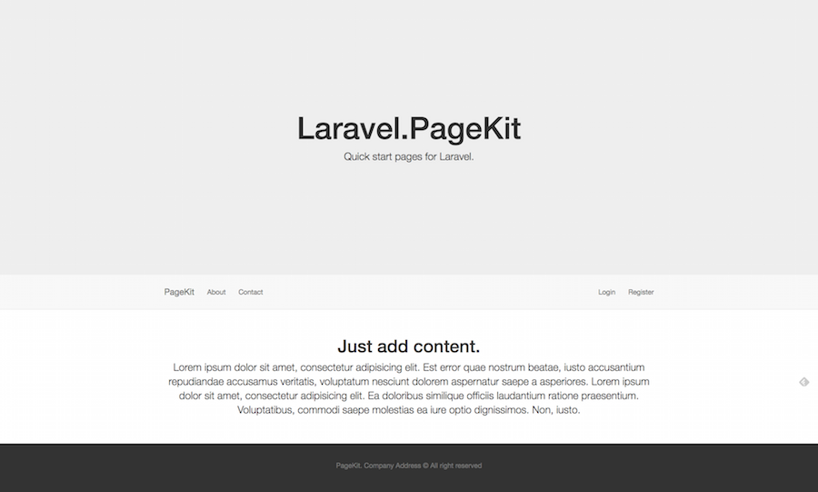
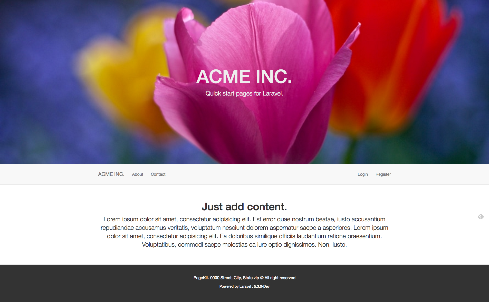

# PageKit



[](https://insight.sensiolabs.com/projects/2b15870b-8188-40ef-be16-96fea6a81bb9)

PageKit is a quick and easy way to replace the standard Laravel install page with a set of clean and modern Start page's for your application. Allowing you to deploy and launch a Laravel based marketing / promotional site in minutes. While you focus on the development. 


## Installation

```

composer require shawnsandy/pagekit

```

__PageKitServiceProvider__

Add PageKitServiceProvider to the providers array in `config/app.php`

```php

ShawnSandy\PageKit\PageKitServiceProvider::class

```

__Publish the pagekit assets__

```php

php artisan vendor:publish --provider="ShawnSandy\PageKit\PageKitServiceProvider"

```

__Publish tags__

You can publish individual pagekit tags using `--tags`, *please note* that the `--public` tag is required for page to display correctly.

```php

php artisan vendor:publish --provider="ShawnSandy\PageKit\PageKitServiceProvider" --tag=name

```


* `-tag=public` publishes your pagekit public assets / files to `/public/` 
* `-tag=views` publishes your views to `vendor\pagekit`
* `-tag=config` publishes `config\pagekit` to `config`
* `-tag=icons` publishes sgv icons (entypo / social) to `public/icons`
* `-tag=icons_material` publishes material svg icons to `public/icons`

## Usage

Once installed correctly you should be able to goto  `http://yoursite.app/pagekit` 

### Default index page

Replace the default *welcome* page with the PageKit index by modifying your `app/Http/route.php` 

```php
Route::get('/', function () {
    return view('welcome');
});
```
*to*

```php
  Route::get('', function(){
        return view('page::index');
    });
```

### Custom Branding

You can custom brand pagekit by editing the values in the `config/pagekit.php` 

Turn branding on:

```php
'branding' => false,
``` 

Customize :

```php

'brand' => [
    'background-color' => '#FFFFFF',
    'header-background-color' => '#EEEEEE',
    'header-font-size' => '72px',
    'font-family' => '"Helvetica Neue", Helvetica, Arial, sans-serif',
    'header-font-color' => '#eee',
    'footer-background-color' => '#333333',
    'footer-color' => '#FFFFFF',
    'header-color' => '#EEEEEE',
    'text-color' => 'FFFFFF',
    'header-background-image' => "https://static.pexels.com/photos/129569/pexels-photo-129569-large.jpeg",
    'logo' => false
]

```

**Custom Header**

```php
header-background-image' => "https://static.pexels.com/photos/129569/pexels-photo-129569-large.jpeg",

```



## TODO

- [ ] Contact form
- [ ] Social media links
- [ ] Add a static page editor
- [ ] Addon style selectors
- [ ] ...

## Contributing

Fork it!
Create your feature branch: git checkout -b my-new-feature
Commit your changes: git commit -am 'Add some feature'
Push to the branch: git push origin my-new-feature
Submit a pull request :D
History

## Change Log

Version 1.3.7

Animate On Scroll Library install
- animates header and footer

Version 1.3.6 BETA

Adds Google Analytics js tracker to default view
Updates to PageKit config settings and readme

Version 1.3.5 BETA

Code analysis passed
Added to SensioLabsInsight for code analysis 
Fixes issues with style rendering for custom branding options

Version 1.3.4 BETA 

Adds a Branding feature

Customize fonts, color, background image etc from the config/pagekit.php file
Updates the readme

Version 1.3.3

...

Version 1.3.2 BETA

- Removes several composer packages


Version 1.3.1 BETA

- Added package config file
- Updated the read-me
- Minor changes to layout/views 


## License

TODO: Modify [licence.md](LICENCE.md)


This project is licensed under the MIT License - see the [LICENSE.md](LICENSE.md) file for details
